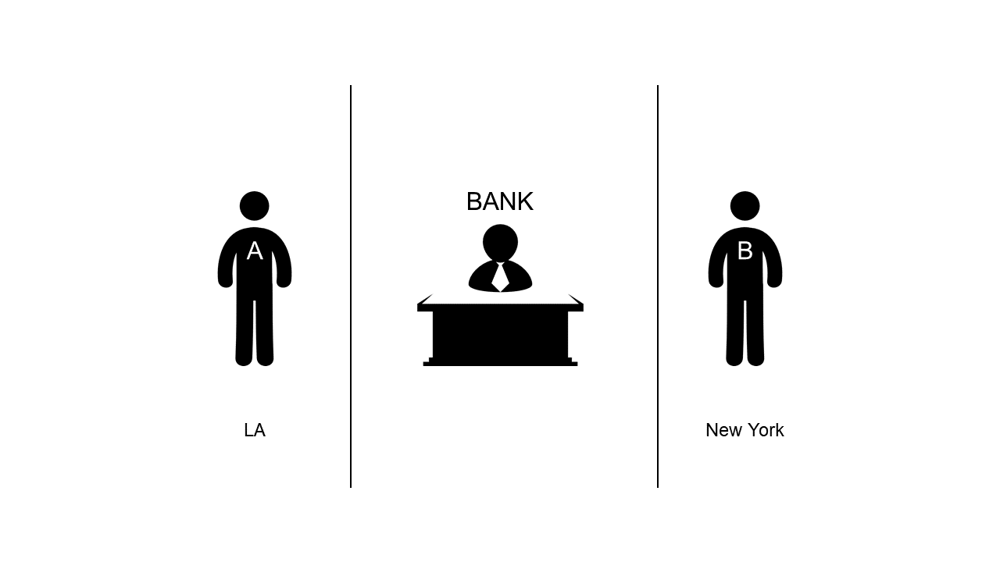

# Chapter 1
### Summary of approve() and transferFrom() of the ERC20
---

We can transfer the ERC20 tokens by using the function transfer() from A account to B account. However, there is another different way to transfer the token.

We can do this by using the approve() function and the transferFrom() function.

These functions let A account to allow some amount of the A's token to be transfered by account B whenever the B wants.

It's quite similar concept of withdrawing the money from the bank.

Now before we head on understand what approve() and transferFrom() do, let's briefly take a look at the smart contract token.

Smart contract token is basically just a numbers tied to the mapping structure of the smart contract.

To be more specific, **the account address** and **the amount of the token the account has** is recorded inside the mapping structure.

~~~
mapping (address => uint256) balances;
~~~

> mapping: A structure where the key data and the value data is bound to each other.
In the structure above, balances, if we put the account address data as the key, it will return the amount of tokens that the account has.

Due to this structure, token is bound to the smart contract.
When the token transaction is made, only the number of the mapping structure changes inside of the token contract. Which is quite different from the coin's transaction where Ether or coins can actually move freely between account to another. Of course both tokens and coins are still bound to the records of transactions.

Because of this structure, if we want to make a smart contract function which requires some amount of tokens, we can's simply use sendTransaction() function to do so.

We need to use approve() and transferFrom().

Below is the example of the real life like implication of using approve() and the transferFrom().

There are two people, Alice and Bob, who are friends to each other.
Alice lives in LA and Bob lives in New York which is quite apart.

Alice had 100$ saved in a bank. Which is stored as Alice's money.

One day, Bob, who needed about 30$ to 50$, asked A if he could lend him some money.
Since Bob was Alice's best friend, Alice happily said yes.

However, since they were living far apart, Alice could not give the money directly to Bob and Bob even didn't have the bank account.

However, there were same bank located in both LA and New York.

So Alice called the bank and told the bank that a dear friend of mine, Bob, will try to withdraw the money using my name which I will allow him to withdraw my money up to 50$.

The bank confirmed the approval.

After the call to the bank, Alice calls the Bob and says that he has allowed Bob to withdraw his money up to 50$.

Bob thanked ALice and went to the bank and asked to withdraw 30$ from Alice account. So the bank withdrawed 30$ to Bob and changed the balance of the Alice from 100$ to 70$. Also, since bob has withdrawed 30$ out of 50$ allowance, bank has reduced the allowance amount to 20$ so that Bob can later withdraw the money if he wants.

Above the story shows the usage of the function approve() and transferFrom() on the real life situation. Of coure in real life Bob would simply make his account on the bank and Alice would simply transfered the money to the Bob's account. However, we are looking at an example of the tokens not the coins, so please bear with me.

On next chapter, we will look at the same process on source code with pictures.
