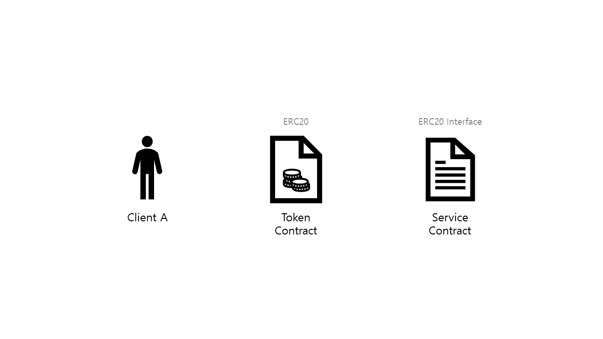
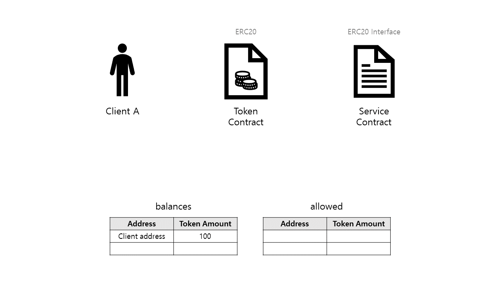
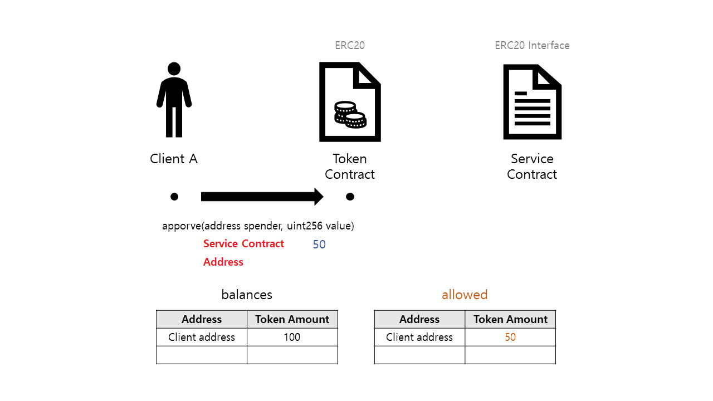
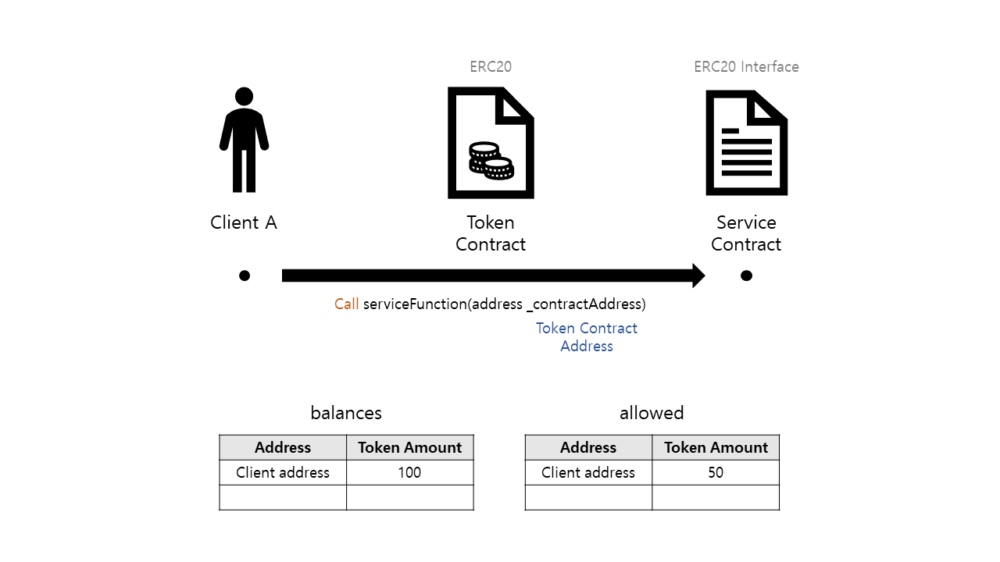
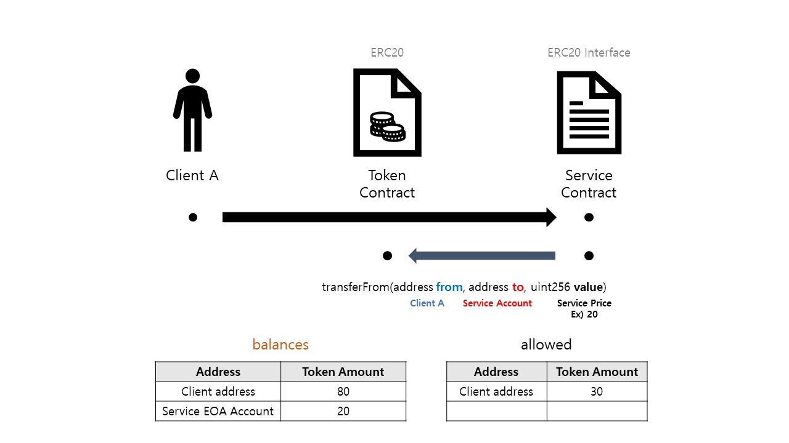
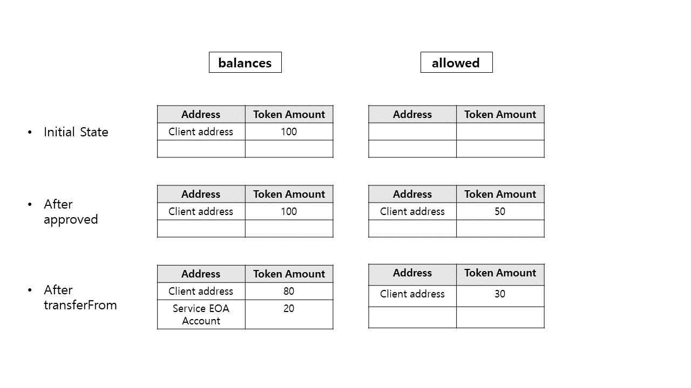

# Chapter 2
---

In this chapter we will take a look at some of the images describing the process of interaction between smart contract that we saw on chapter 1.

In interaction subject, there will be client A and the service contract which the client wants to use.

This client has 100 tokens.
The information about the amount and the owner of the token is recorded inside of mapping structure called balances.

In order for the client A to use the service function of the service contract, the client has to pay some amount of token to the service contract.

If client A simply sends the token to the service contract using transfer(), the service contract won't know which function() the client wants to use.

In order for the service contract to get paid by client using the specific function, transfer must be done inside of the function.

Now client A needs to do 2 things.

1. Client A calls the approve() function from the token contract. **The msg.sender who calls the approve() is the client A** here and the client will send the address of the service contract and amount of tokens as a parameter.

2. Client A will call the function he wants to call from the service contract. He will give the token contract address as a parameter.

Now the service contract will use the **token contract's address** and make the token contract instance. With this instance and ERC20 token interface, the service contract can now interact with the functions of the token contract.
One thing to bear thing in mind is that **when the instance calls the function of the token contract, the msg.sender will be the address of the service contract.**

~~~Solidity
// Calling with instance example
contract ERC20 {  
  function  transferFrom(address from, address to, uint256 value) public returns (bool);
}

contract ServiceContract{

  function doService(address _TokenContractAddress) public{
      ERC20 ercInstance = ERC20(_TokenContractAddress);

      ercInstance.transferFrom(msg.sender, address(this), 20);
      // Second parameter will hold the address
      // that will get the token from client A

  }

}
~~~

With the token contract instance, the ServiceContract will call transferFrom() with the parameter which are the msg.sender (client A) who called the doService() function, and the address which will get the token from client A (for now, the ServiceContract itself will get the token by using address(this)) and lastly the amount of token that needs to be transferred.

> **Please bear in mind that the msg.sender that is calling the transferFrom of the token contract using the token instance is the service contract address, while the 'msg.sender' as a parameter of the transferFrom is the address of the client A.**

Let's take a look at the transferFrom() source code for a second.

~~~Solidity
// Mapping structure that records the allowed tokens amount
// Info about the 'Client A has => (allowed Service Contract => the Amount)'
mapping (address => mapping (address => uint256)) internal allowed;

/**
 * @dev Transfer tokens from one address to another
 * @param _from address The address which you want to send tokens from
 * @param _to address The address which you want to transfer to
 * @param _value uint256 the amount of tokens to be transferred
 */
function transferFrom(address _from, address _to, uint256 _value) public returns (bool) {
  require(_to != address(0));
  require(_value <= balances[_from]);
  require(_value <= allowed[_from][msg.sender]);

  balances[_from] = balances[_from].sub(_value);
  balances[_to] = balances[_to].add(_value);
  allowed[_from][msg.sender] = allowed[_from][msg.sender].sub(_value);
  emit Transfer(_from, _to, _value);
  return true;
}
~~~

Above is the ERC20's transferFrom function which implemented the ERC20 interface
The ERC20 stands for the 20th requested standard ideas for the tokens.

Those who have implemented this ERC20 request will follow the same interface or the function.
Thanks to these standards, token contracts doesn't need to check the other contract's interface everytime they want to interact with each other.

Today the ERC20 standard is one of the most used standard on the token network.

Now, let's get back to the source code above. The subject who called the token contract's transferFrom is the service contract. Which means the msg.sender is the address of the service contract. The parameter \_from will be the address of the client A, \_to will be the address where the tokens will be transferred (for now it's the service contract address) and lastly \_value will be the amount of token that will be transferred.

Let's follow the code.

- From the mapping structure balances[], which holds the balances of the tokens, it will sub \_value amount of the tokens from client A's account.
- Then it will add the exact \_value amount to \_to address. If the \_to address didn't existed, it will allocate the address inside the mapping structure and add the tokens.
- Lastly, it will sub the \_value amount of token from the mapping structure, allowed[] since the \_value amount of token has been transferred.

Through this process the service contract has successfully received the token from the client A.

This is the summary of the whole process divided into three step.

1. Inside token contract, the balances[] structure holds the 100 tokens of the client A.
2. Client A approves the service contract to take up to 50 tokens from his account.
3. Service contract will use the transferFrom of the token contract and transfer 20 tokens out of 50 that were allowed by client A.

Now we have looked at the process between the token contract and the service contract through the source code and the images.

On next chapter we will test the whole process by using the Remix(Solidity IDE) and the actual full source code.
