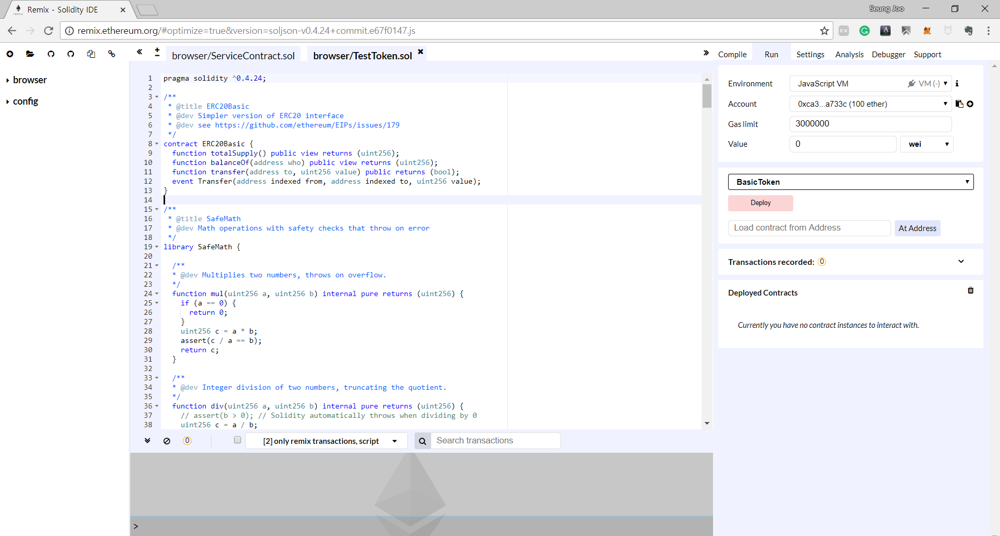
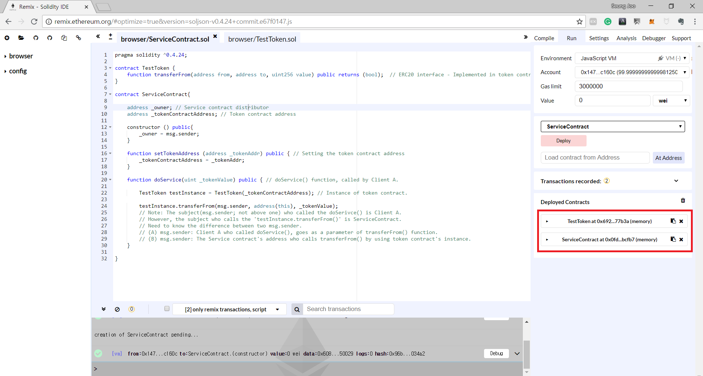
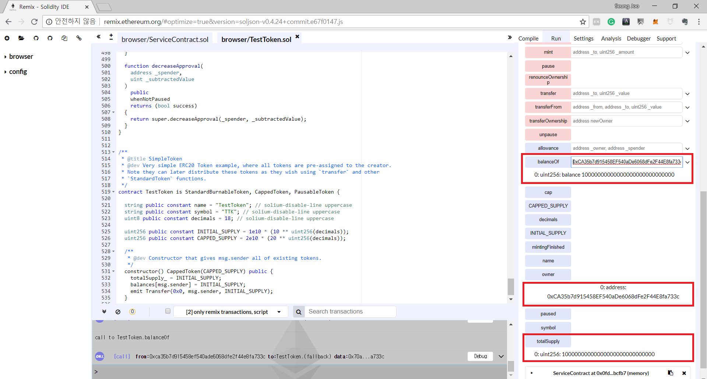
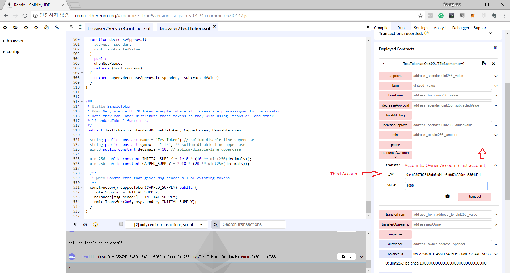
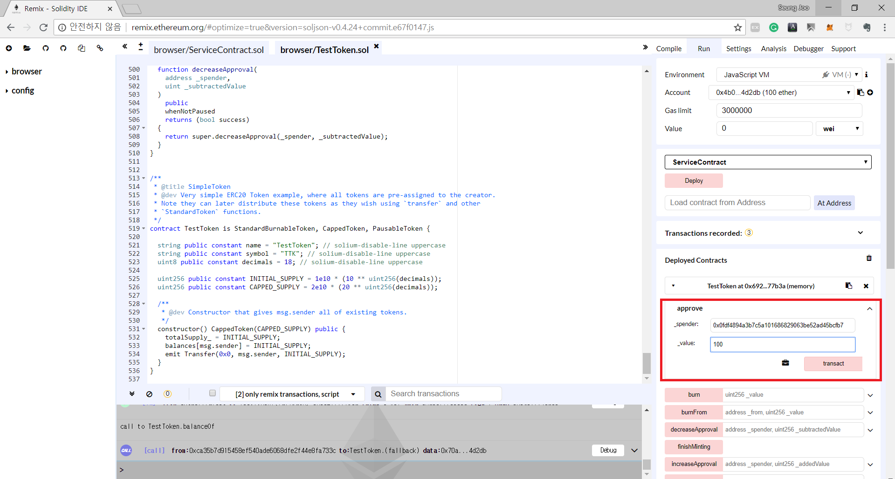
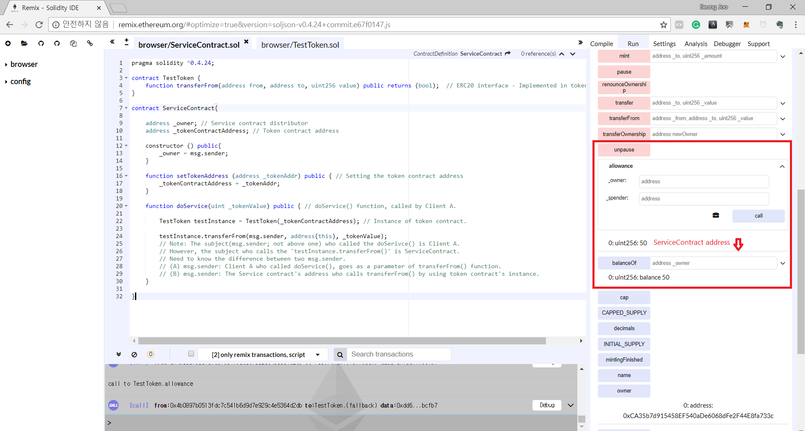

#Chapter 3
transferFrom practice
---

Below is the service contract source code that the client will use.

~~~
pragma solidity ^0.4.24;

contract TestToken {
    function transferFrom(address from, address to, uint256 value) public returns (bool);  // ERC20 interface - Implemented inside the token contract
}

contract ServiceContract{

    address _owner; // Distributor of the ServiceContract
    address _tokenContractAddress; // Token contract address

    constructor () public{
        _owner = msg.sender;
    }

    function setTokenAddress (address _tokenAddr) public { // Setting the token contract address
        _tokenContractAddress = _tokenAddr;
    }

    function doService(uint _tokenValue) public { //doSerivce() which will be called by client A
                                                  //In order to use this function, client must send token to this contrac

        TestToken testInstance = TestToken(_tokenContractAddress); // Assigning token contract instance.

        testInstance.transferFrom(msg.sender, address(this), _tokenValue);  
        // Bear in mind that the msg.sender who is called doService function is client A
        // However the msg.sender who is calling the transferFrom is the service contract.
        // Must know the differences between these two msg.sender
        // (A) msg.sender: Client A who called doService(), goes as a parameter, msg.sender, of the function transferFrom()
        // (B) msg.sender: Service contract address who calls the transferFrom() of the token contract using the token instance.
    }

}
~~~

The main important factor you need to know is all written inside service contract code as an annotation.
We must keep in mind the difference between these two msg.sender.

Now let's take a look at some of the source code of the token contract.

~~~
// A function that let _spender to use _value amount of money from msg.sender

function approve(address _spender, uint256 _value) public returns (bool) {
  allowed[msg.sender][_spender] = _value;
  emit Approval(msg.sender, _spender, _value);
  return true;
}
~~~

Approve is not a difficult function to understand.
All you need to know is to understand the structure, allowed[msg.sender][allows _spender] = \_value amount of money.
As I have mentioned before, the process of sending the token to a contract goes like below.

1. In order for service contract to transfer money from client A to itself, the client needs to allow some amount of tokens to the service contract.
2. When the clinet A calls the service contract's function, it will use the transferFrom() function to transfer the token to itself.

Next we have transferFrom() source code.

~~~
// We have called this function as transferFrom(client A (msg.sender), service contract address (address(this)), amount of token (_tokenValue))
// Service contract address will be the msg.sender who calls transferFrom function.

function transferFrom(address _from, address _to, uint256 _value) public returns (bool) {
  emit whoIsTheMessageSender(msg.sender, "Invoked from ERC20 Token itself"); // msg.sender is service contract address

  require(_to != address(0));
  require(_value <= balances[_from]); // Client A needs to have larger amount of token than it needs to send.
  require(_value <= allowed[_from][msg.sender]); // Allowed token amount by client A to the service contract.

  balances[_from] = balances[_from].sub(_value); // Reduces the paid amount
  balances[_to] = balances[_to].add(_value); // Increases the paid amount to service contract account
  allowed[_from][msg.sender] = allowed[_from][msg.sender].sub(_value); // Reduces the allowed amount of token that the service contract has transfered.

  emit Transfer(_from, _to, _value);
  return true;
}
~~~

transferFrom() will send the \_value amount of token that msg.sender was approved by \_from to \_to (\_to will be the service contract itself since it sent the parameter with address(this)).
msg.sender who called transferFrom is the service contract and the parameter \_from is the client A.

Now let's begin practicing the whole approve() and transferFrom() process with service contract code and a ERC20 token code.

First, make TestToken.sol and ServiceContract.sol in [Remix](http://remix.ethereum.org/#optimize=false&version=soljson-v0.4.24+commit.e67f0147.js) and paste each source code presented below.

### ServiceContract.sol

~~~
pragma solidity ^0.4.24;

contract TestToken {
    function transferFrom(address from, address to, uint256 value) public returns (bool);  // ERC20 interface.
}

contract ServiceContract{

    address _owner; // Contract distributor
    address _tokenContractAddress; // Token contract address.

    constructor () public{
        _owner = msg.sender;
    }

    function setTokenAddress (address _tokenAddr) public {
        _tokenContractAddress = _tokenAddr;
    }

    function doService(uint _tokenValue) public {

        TestToken testInstance = TestToken(_tokenContractAddress);
        testInstance.transferFrom(msg.sender, address(this), _tokenValue);  
    }

}
~~~

 

### TestToken.sol

~~~
pragma solidity ^0.4.24;

/**
 * @title ERC20Basic
 * @dev Simpler version of ERC20 interface
 * @dev see https://github.com/ethereum/EIPs/issues/179
 */
contract ERC20Basic {
  function totalSupply() public view returns (uint256);
  function balanceOf(address who) public view returns (uint256);
  function transfer(address to, uint256 value) public returns (bool);
  event Transfer(address indexed from, address indexed to, uint256 value);
}

/**
 * @title SafeMath
 * @dev Math operations with safety checks that throw on error
 */
library SafeMath {

  /**
  * @dev Multiplies two numbers, throws on overflow.
  */
  function mul(uint256 a, uint256 b) internal pure returns (uint256) {
    if (a == 0) {
      return 0;
    }
    uint256 c = a * b;
    assert(c / a == b);
    return c;
  }

  /**
  * @dev Integer division of two numbers, truncating the quotient.
  */
  function div(uint256 a, uint256 b) internal pure returns (uint256) {
    // assert(b > 0); // Solidity automatically throws when dividing by 0
    uint256 c = a / b;
    // assert(a == b * c + a % b); // There is no case in which this doesn't hold
    return c;
  }

  /**
  * @dev Subtracts two numbers, throws on overflow (i.e. if subtrahend is greater than minuend).
  */
  function sub(uint256 a, uint256 b) internal pure returns (uint256) {
    assert(b <= a);
    return a - b;
  }

  /**
  * @dev Adds two numbers, throws on overflow.
  */
  function add(uint256 a, uint256 b) internal pure returns (uint256) {
    uint256 c = a + b;
    assert(c >= a);
    return c;
  }
}

/**
 * @title Basic token
 * @dev Basic version of StandardToken, with no allowances.
 */
contract BasicToken is ERC20Basic {
  using SafeMath for uint256;

  mapping(address => uint256) balances;

  uint256 totalSupply_;

  /**
  * @dev total number of tokens in existence
  */
  function totalSupply() public view returns (uint256) {
    return totalSupply_;
  }

  /**
  * @dev transfer token for a specified address
  * @param _to The address to transfer to.
  * @param _value The amount to be transferred.
  */
  function transfer(address _to, uint256 _value) public returns (bool) {
    require(_to != address(0));
    require(_value <= balances[msg.sender]);

    // SafeMath.sub will throw if there is not enough balance.
    balances[msg.sender] = balances[msg.sender].sub(_value);
    balances[_to] = balances[_to].add(_value);
    emit Transfer(msg.sender, _to, _value);
    return true;
  }

  /**
  * @dev Gets the balance of the specified address.
  * @param _owner The address to query the the balance of.
  * @return An uint256 representing the amount owned by the passed address.
  */
  function balanceOf(address _owner) public view returns (uint256 balance) {
    return balances[_owner];
  }
}

/**
 * @title ERC20 interface
 * @dev see https://github.com/ethereum/EIPs/issues/20
 */
contract ERC20 is ERC20Basic {
  function allowance(address owner, address spender) public view returns (uint256);
  function transferFrom(address from, address to, uint256 value) public returns (bool);
  function approve(address spender, uint256 value) public returns (bool);
  event Approval(address indexed owner, address indexed spender, uint256 value);
}

/**
 * @title Standard ERC20 token
 *
 * @dev Implementation of the basic standard token.
 * @dev https://github.com/ethereum/EIPs/issues/20
 * @dev Based on code by FirstBlood: https://github.com/Firstbloodio/token/blob/master/smart_contract/FirstBloodToken.sol
 */
contract StandardToken is ERC20, BasicToken {

  mapping (address => mapping (address => uint256)) internal allowed;

  /**
   * @dev Transfer tokens from one address to another
   * @param _from address The address which you want to send tokens from
   * @param _to address The address which you want to transfer to
   * @param _value uint256 the amount of tokens to be transferred
   */
  function transferFrom(address _from, address _to, uint256 _value) public returns (bool) {
    require(_to != address(0));
    require(_value <= balances[_from]);
    require(_value <= allowed[_from][msg.sender]);

    balances[_from] = balances[_from].sub(_value);
    balances[_to] = balances[_to].add(_value);
    allowed[_from][msg.sender] = allowed[_from][msg.sender].sub(_value);
    emit Transfer(_from, _to, _value);
    return true;
  }

  /**
   * @dev Approve the passed address to spend the specified amount of tokens on behalf of msg.sender.
   *
   * Beware that changing an allowance with this method brings the risk that someone may use both the old
   * and the new allowance by unfortunate transaction ordering. One possible solution to mitigate this
   * race condition is to first reduce the spender's allowance to 0 and set the desired value afterwards:
   * https://github.com/ethereum/EIPs/issues/20#issuecomment-263524729
   * @param _spender The address which will spend the funds.
   * @param _value The amount of tokens to be spent.
   */
  function approve(address _spender, uint256 _value) public returns (bool) {
    allowed[msg.sender][_spender] = _value;
    emit Approval(msg.sender, _spender, _value);
    return true;
  }

  /**
   * @dev Function to check the amount of tokens that an owner allowed to a spender.
   * @param _owner address The address which owns the funds.
   * @param _spender address The address which will spend the funds.
   * @return A uint256 specifying the amount of tokens still available for the spender.
   */
  function allowance(address _owner, address _spender) public view returns (uint256) {
    return allowed[_owner][_spender];
  }

  /**
   * @dev Increase the amount of tokens that an owner allowed to a spender.
   *
   * approve should be called when allowed[_spender] == 0. To increment
   * allowed value is better to use this function to avoid 2 calls (and wait until
   * the first transaction is mined)
   * From MonolithDAO Token.sol
   * @param _spender The address which will spend the funds.
   * @param _addedValue The amount of tokens to increase the allowance by.
   */
  function increaseApproval(address _spender, uint _addedValue) public returns (bool) {
    allowed[msg.sender][_spender] = allowed[msg.sender][_spender].add(_addedValue);
    emit Approval(msg.sender, _spender, allowed[msg.sender][_spender]);
    return true;
  }

  /**
   * @dev Decrease the amount of tokens that an owner allowed to a spender.
   *
   * approve should be called when allowed[_spender] == 0. To decrement
   * allowed value is better to use this function to avoid 2 calls (and wait until
   * the first transaction is mined)
   * From MonolithDAO Token.sol
   * @param _spender The address which will spend the funds.
   * @param _subtractedValue The amount of tokens to decrease the allowance by.
   */
  function decreaseApproval(address _spender, uint _subtractedValue) public returns (bool) {
    uint oldValue = allowed[msg.sender][_spender];
    if (_subtractedValue > oldValue) {
      allowed[msg.sender][_spender] = 0;
    } else {
      allowed[msg.sender][_spender] = oldValue.sub(_subtractedValue);
    }
    emit Approval(msg.sender, _spender, allowed[msg.sender][_spender]);
    return true;
  }
}

/**
 * @title Ownable
 * @dev The Ownable contract has an owner address, and provides basic authorization control
 * functions, this simplifies the implementation of "user permissions".
 */
contract Ownable {
  address public owner;

  event OwnershipRenounced(address indexed previousOwner);
  event OwnershipTransferred(
    address indexed previousOwner,
    address indexed newOwner
  );

  /**
   * @dev The Ownable constructor sets the original `owner` of the contract to the sender
   * account.
   */
  constructor() public {
    owner = msg.sender;
  }

  /**
   * @dev Throws if called by any account other than the owner.
   */
  modifier onlyOwner() {
    require(msg.sender == owner);
    _;
  }

  /**
   * @dev Allows the current owner to transfer control of the contract to a newOwner.
   * @param newOwner The address to transfer ownership to.
   */
  function transferOwnership(address newOwner) public onlyOwner {
    require(newOwner != address(0));
    emit OwnershipTransferred(owner, newOwner);
    owner = newOwner;
  }

  /**
   * @dev Allows the current owner to relinquish control of the contract.
   */
  function renounceOwnership() public onlyOwner {
    emit OwnershipRenounced(owner);
    owner = address(0);
  }
}

/**
 * @title Burnable Token
 * @dev Token that can be irreversibly burned (destroyed).
 */
contract BurnableToken is BasicToken {

  event Burn(address indexed burner, uint256 value);

  /**
   * @dev Burns a specific amount of tokens.
   * @param _value The amount of token to be burned.
   */
  function burn(uint256 _value) public {
    _burn(msg.sender, _value);
  }

  function _burn(address _who, uint256 _value) internal {
    require(_value <= balances[_who]);
    // no need to require value <= totalSupply, since that would imply the
    // sender's balance is greater than the totalSupply, which *should* be an assertion failure

    balances[_who] = balances[_who].sub(_value);
    totalSupply_ = totalSupply_.sub(_value);
    emit Burn(_who, _value);
    emit Transfer(_who, address(0), _value);
  }
}

/**
 * @title Standard Burnable Token
 * @dev Adds burnFrom method to ERC20 implementations
 */
contract StandardBurnableToken is BurnableToken, StandardToken {

  /**
   * @dev Burns a specific amount of tokens from the target address and decrements allowance
   * @param _from address The address which you want to send tokens from
   * @param _value uint256 The amount of token to be burned
   */
  function burnFrom(address _from, uint256 _value) public {
    require(_value <= allowed[_from][msg.sender]);
    // Should https://github.com/OpenZeppelin/zeppelin-solidity/issues/707 be accepted,
    // this function needs to emit an event with the updated approval.
    allowed[_from][msg.sender] = allowed[_from][msg.sender].sub(_value);
    _burn(_from, _value);
  }
}

/**
 * @title Mintable token
 * @dev Simple ERC20 Token example, with mintable token creation
 * @dev Issue: * https://github.com/OpenZeppelin/openzeppelin-solidity/issues/120
 * Based on code by TokenMarketNet: https://github.com/TokenMarketNet/ico/blob/master/contracts/MintableToken.sol
 */
contract MintableToken is StandardToken, Ownable {
  event Mint(address indexed to, uint256 amount);
  event MintFinished();

  bool public mintingFinished = false;

  modifier canMint() {
    require(!mintingFinished);
    _;
  }

  modifier hasMintPermission() {
    require(msg.sender == owner);
    _;
  }

  /**
   * @dev Function to mint tokens
   * @param _to The address that will receive the minted tokens.
   * @param _amount The amount of tokens to mint.
   * @return A boolean that indicates if the operation was successful.
   */
  function mint(
    address _to,
    uint256 _amount
  )
    hasMintPermission
    canMint
    public
    returns (bool)
  {
    totalSupply_ = totalSupply_.add(_amount);
    balances[_to] = balances[_to].add(_amount);
    emit Mint(_to, _amount);
    emit Transfer(address(0), _to, _amount);
    return true;
  }

  /**
   * @dev Function to stop minting new tokens.
   * @return True if the operation was successful.
   */
  function finishMinting() onlyOwner canMint public returns (bool) {
    mintingFinished = true;
    emit MintFinished();
    return true;
  }
}

/**
 * @title Capped token
 * @dev Mintable token with a token cap.
 */
contract CappedToken is MintableToken {

  uint256 public cap;

  constructor(uint256 _cap) public {
    require(_cap > 0);
    cap = _cap;
  }

  /**
   * @dev Function to mint tokens
   * @param _to The address that will receive the minted tokens.
   * @param _amount The amount of tokens to mint.
   * @return A boolean that indicates if the operation was successful.
   */
  function mint(
    address _to,
    uint256 _amount
  )
    onlyOwner
    canMint
    public
    returns (bool)
  {
    require(totalSupply_.add(_amount) <= cap);

    return super.mint(_to, _amount);
  }

}

/**
 * @title Pausable
 * @dev Base contract which allows children to implement an emergency stop mechanism.
 */
contract Pausable is Ownable {
  event Pause();
  event Unpause();

  bool public paused = false;

  /**
   * @dev Modifier to make a function callable only when the contract is not paused.
   */
  modifier whenNotPaused() {
    require(!paused);
    _;
  }

  /**
   * @dev Modifier to make a function callable only when the contract is paused.
   */
  modifier whenPaused() {
    require(paused);
    _;
  }

  /**
   * @dev called by the owner to pause, triggers stopped state
   */
  function pause() onlyOwner whenNotPaused public {
    paused = true;
    emit Pause();
  }

  /**
   * @dev called by the owner to unpause, returns to normal state
   */
  function unpause() onlyOwner whenPaused public {
    paused = false;
    emit Unpause();
  }
}

/**
 * @title Pausable token
 * @dev StandardToken modified with pausable transfers.
 **/
contract PausableToken is StandardToken, Pausable {

  function transfer(
    address _to,
    uint256 _value
  )
    public
    whenNotPaused
    returns (bool)
  {
    return super.transfer(_to, _value);
  }

  function transferFrom(
    address _from,
    address _to,
    uint256 _value
  )
    public
    whenNotPaused
    returns (bool)
  {
    return super.transferFrom(_from, _to, _value);
  }

  function approve(
    address _spender,
    uint256 _value
  )
    public
    whenNotPaused
    returns (bool)
  {
    return super.approve(_spender, _value);
  }

  function increaseApproval(
    address _spender,
    uint _addedValue
  )
    public
    whenNotPaused
    returns (bool success)
  {
    return super.increaseApproval(_spender, _addedValue);
  }

  function decreaseApproval(
    address _spender,
    uint _subtractedValue
  )
    public
    whenNotPaused
    returns (bool success)
  {
    return super.decreaseApproval(_spender, _subtractedValue);
  }
}

/**
 * @title SimpleToken
 * @dev Very simple ERC20 Token example, where all tokens are pre-assigned to the creator.
 * Note they can later distribute these tokens as they wish using `transfer` and other
 * `StandardToken` functions.
 */
contract MyToken is StandardBurnableToken, CappedToken, PausableToken {

  string public constant name = "MyToken"; // solium-disable-line uppercase
  string public constant symbol = "MTK"; // solium-disable-line uppercase
  uint8 public constant decimals = 18; // solium-disable-line uppercase

  uint256 public constant INITIAL_SUPPLY = 1e10 * (10 ** uint256(decimals));
  uint256 public constant CAPPED_SUPPLY = 2e10 * (20 ** uint256(decimals));

  /**
   * @dev Constructor that gives msg.sender all of existing tokens.
   */
  constructor() CappedToken(CAPPED_SUPPLY) public {
    totalSupply_ = INITIAL_SUPPLY;
    balances[msg.sender] = INITIAL_SUPPLY;
    emit Transfer(0x0, msg.sender, INITIAL_SUPPLY);
  }
}

~~~

If you have successfully deployed each contract, you will see the following screen.

Go to the Run tab and set the Environment to JavaScript VM.

Then, select TestToken.sol and compile by going to Compile tab and clicking on Start or Ctrl = s.

If you have successfully compiled the code, you will see each contracts in a green box that was written inside TestToken.sol.

Go to the Run tab and choose TestToken from drop down menu and press Deploy button to deploy the contract.

Then the account (First account in this situation) that deployed the TestToken contract will pay small amount of wei to deploy the contract.

You will now see the name and the address of the TestToken in the Deployed Contracts section.

Now that the token contract is deployed, let's do the same process to the ServiceContract.sol.

Choose ServiceContract.sol and compile it and choose ServiceContract on drop down menu.

Choose second account from Account tab and press Deploy button.

> In remix, if you compile, the amount of wei that each account has resets. So you might see that the first account which deployed the TestToken has now 100 eth again. However, the address doesn't change so you don't have to worry about that. Also in order to run the contract, sometimes you might need to compile the contract that you want to use first.

Now the wei amount of the second account will decrease and the ServiceContract will be deployed.

If you have successfully deployed each contract, you will see the following screen.

Now click on the TestToken.

You will see all sorts of function that the TestToken has.

Take a look at the owner and totalSupply function. If you click on it, it will show you the owner(deployer of this contract: The first account address) and the total supply of the token(10000000000000000000000000000).

In this token contract, the owner will hold the total supply.
If you want to check this, you can put the address of the owner account (the first account) and put it as a parameter of balanceOf function. Then you will get the number like below.

Now let's set the situation for client A.

We will assume the third account will be the client A.

Since third account does not have any token for the moment, let's send 1000 token to third account.
Copy the third account address to clip board and choose the first account. Then send the 1000 token to third account address using the transfer() function below.

If you have successfully transfered 1000 token to third account, you will see that the third account has 1000 token using balanceOf function.

Now, we are ready to begin the approve and transferFrom process.

First, client A will approve some of his token to the ServiceContract.

Choose third account from Account tab and copy and past the ServiceContract address.
Then, use approve function of the TestToken and put the address of the ServiceContract and amount(1000).

If you want to know if the approved has been successful, you can use allowance function to check it.
Put third account address and the ServiceContract address as a parameter of allowance function. You will see the amount that we have approved.

Now it's time to use the ServiceContract's doService function.

First, we will use setTokenAddress from ServiceContract to set the instance of the token contract. Copy and paste the TestToken contract's address to the function.

Now the ServiceContract will use the functions from the TestToken.

Now let's use the doService function as client A.

> If this was a real life contract, the amount of token that needs to be paid will be already implemented inside doService like function. However we are learning about the usage of the approve and transferFrom function so we will set the paying amount ourself for now.

Let's assume that the cost to use doService function is 50 token. So let's put 50 as a parameter to doService and call the function.
Then the below code will be processed.

~~~
testInstance.transferFrom(msg.sender, address(this), _tokenValue);  
~~~

Through this code, the ServiceContract must have received 50 token from client A.

In order to check this, let's go to TestToken and use balanceOf function using the ServiceContract address. You will see that the ServiceContract now has 50 token.
Also, if you check the allowance using the third account's address and the ServiceContract's address, you will see that it has decreased from 100 to 50. Since the approved tokens have been used, the amount that is allowed has also decreased.

This has been the article about the function approve() and the transferFrom()

I hope this article was helpful understanding ERC20 token standard.
